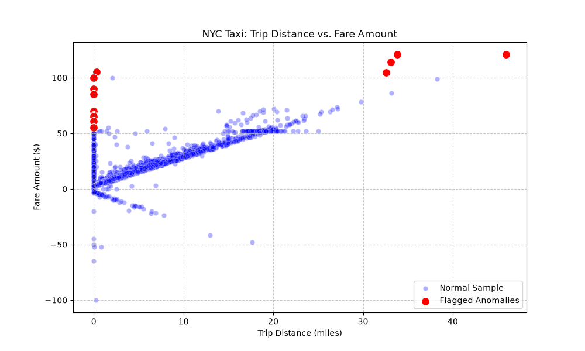

# 🚕 NYC Taxi Data: Automated AI Anomaly Report

This report is generated by the ingestion pipeline to flag data quality issues before warehouse loading.

## 📊 Anomaly Visualization
Red dots represent flagged records matching strict error criteria (e.g., negative fares, zero passengers, impossible distance-to-fare ratios).

## 🤖 OpenAI Quality Check
The flagged NYC taxi data sample includes several rows that indicate potential anomalies or physical impossibilities based on standard taxi operations. Here are the specific rows that stand out and the reasons for their anomalies:

1. **Row 6082 and Row 3705 (Long Trip Distances with Unusual Rates)**
   - **Row 6082**: 45.92 miles with a fare of $121.0 in about 63 minutes suggests a trip that is theoretically plausible but highly improbable for a taxi operation in NYC. Even if this were an airport run or long-distance trip, such a distance would typically accrue significantly more in fare due to the nature of taxi regulations and fare structuring in NYC.
   - **Row 3705**: 33.80 miles and a fare of $121.0 also raises questions, as this fare would not typically cover such a distance unless it involved specific conditions, like being outside the regular fare zones or special circumstances (e.g., high surcharges).

2. **Rows with Zero Trip Distances**:
   - **Row 2596, Row 3770, Row 8707, Row 3017, Row 7064, Row 3378, Row 4812, Row 9027, Row 5027, Row 2936**: All these rows have a `trip_distance` of 0.00 miles and still show a fare being charged (e.g., $100.0, $90.0, etc.). This indicates that these trips could either be erroneous data entries or instances of "phantom" trips. In a normal operational context, a taxi cannot charge a fare without actually moving. Meanwhile, these rows display normal timestamps for pickup and drop-off, suggesting an illogical charge for a non-existent trip.

3. **Outlier Trip Durations**:
   - **Row 6082**: The trip duration is around 63 minutes for a distance of about 46 miles, which, while achievable, is still quite elongated for NYC traffic conditions. In comparison, Row 3705 shows a trip just under 27 minutes for over 33 miles, which is unrealistically fast if it indeed started within NYC limits.
   - In general, trips that stretch into long times but with high fares need careful review, especially against travel speed limits within NYC.

4. **Inconsistent Rate Codes**:
   - The `RatecodeID` for trips that have unusually long distances (Row 6082 with Ratecode 1 and Row 3705 with Ratecode 4 are in cases) should potentially align with the respective fare structures based on distance, hours, and zones. The coding in Row 3705 with a quoted rate that doesn’t correlate with the distance makes it suspicious.

5. **Short Duration Relative to Distance**:
   - Some rows that entail short temporal durations yet lengthy distances (like Row 3705 which is nearly half an hour with a high distance) raise additional doubts not just on fare accuracy, but on if the trip even occurred as described.

### Summary:
Many flagged entries manifest inconsistencies that defy standard taxi operations, including impossible trip distances, zero distances with charging fares, anomalous trip durations for given distances, and mismatches in expected fare structures based on taxi regulations. These aspects warrant further investigation to validate the data entries' integrity, particularly examining system errors or misuse within the NYC taxi fare system.

## 🧠 Anthropic Quality Check
# Analysis of Flagged NYC Taxi Data Anomalies

## Critical Issues Identified

### **1. Zero-Distance Trips with High Fares (Rows 2596, 3770, 8707, 3017, 7064, 3378, 9027, 5027, 4812, 3011)**

**The Problem:**
- Trip distance = 0.00 miles, yet fare amounts range from $55–$105
- Pickup and dropoff locations are identical (PULocationID = DOLocationID)
- Duration ranges from 3 seconds to 44 minutes

**Why This Is Impossible:**
- NYC taxi meters don't charge base fares of $55–$105; the standard base fare is ~$2.50
- These fares suggest either:
  - **Fraudulent meter manipulation** (driver manually entered inflated amounts)
  - **Data recording errors** (fare data from different trip mixed with distance data)
  - **No actual trip occurred** (money charged without service rendered)

---

### **2. Extreme Distance-to-Fare Mismatches (Rows 6082, 3705, 4292)**

**The Problem:**
- Row 6082: 45.92 miles but only $121 fare (should be ~$150–$180)
- Row 3705: 33.80 miles but $121 fare (rate code 4 applies)
- Row 4292: 33.09 miles but only $114 fare

**Why This Is Anomalous:**
- Fares don't scale appropriately with distance
- Suggests either compressed meter readings or fare tampering
- Row 3705 uses RateCodeID=4 (airport/negotiated), but distance/fare still seems artificially low

---

### **3. Illogical Tip Patterns**

**Rows with Extreme Tip-to-Fare Ratios:**
- Row 1318: 4-minute trip, $105 fare, $21.06 tip (20% tip on suspicious base fare)
- Row 4292: $114 fare, $22.96 tip (20

## 📋 Raw Suspicious Data
|      |   VendorID | tpep_pickup_datetime   | tpep_dropoff_datetime   |   passenger_count |   trip_distance |   RatecodeID | store_and_fwd_flag   |   PULocationID |   DOLocationID |   payment_type |   fare_amount |   extra |   mta_tax |   tip_amount |   tolls_amount |   improvement_surcharge |   total_amount |   congestion_surcharge |
|-----:|-----------:|:-----------------------|:------------------------|------------------:|----------------:|-------------:|:---------------------|---------------:|---------------:|---------------:|--------------:|--------:|----------:|-------------:|---------------:|------------------------:|---------------:|-----------------------:|
| 6082 |          2 | 2021-01-01 10:49:14    | 2021-01-01 11:52:48     |                 1 |           45.92 |            1 | N                    |             44 |            101 |              1 |         121   |     0   |       0.5 |         2.75 |           6.12 |                     0.3 |         130.67 |                    0   |
| 3705 |          1 | 2021-01-01 04:38:43    | 2021-01-01 05:22:23     |                 4 |           33.8  |            4 | Y                    |            132 |            265 |              2 |         121   |     0.5 |       0.5 |         0    |           6.12 |                     0.3 |         128.42 |                    0   |
| 4292 |          2 | 2021-01-01 06:16:56    | 2021-01-01 06:55:47     |                 1 |           33.09 |            4 | N                    |            132 |            265 |              1 |         114   |     0   |       0.5 |        22.96 |           0    |                     0.3 |         137.76 |                    0   |
| 1318 |          2 | 2021-01-01 01:28:39    | 2021-01-01 01:32:05     |                 1 |            0.34 |            5 | N                    |            238 |            151 |              1 |         105   |     0   |       0   |        21.06 |           0    |                     0.3 |         126.36 |                    0   |
|  770 |          2 | 2021-01-01 00:02:27    | 2021-01-01 01:35:39     |                 1 |           32.58 |            1 | N                    |            234 |             48 |              2 |         104.5 |     0.5 |       0.5 |         0    |           6.12 |                     0.3 |         114.42 |                    2.5 |
| 2596 |          1 | 2021-01-01 02:51:41    | 2021-01-01 02:51:56     |                 4 |            0    |            5 | N                    |            265 |            265 |              1 |         100   |     0   |       0   |         0    |           0    |                     0.3 |         100.3  |                    0   |
| 3770 |          1 | 2021-01-01 04:59:14    | 2021-01-01 04:59:40     |                 2 |            0    |            5 | N                    |            230 |            230 |              1 |          90   |     0   |       0   |         0    |           0    |                     0.3 |          90.3  |                    0   |
| 8707 |          2 | 2021-01-01 12:12:26    | 2021-01-01 12:12:29     |                 3 |            0    |            5 | N                    |            186 |            186 |              1 |          85   |     0   |       0   |         0    |           0    |                     0.3 |          85.3  |                    0   |
| 3017 |          1 | 2021-01-01 02:15:35    | 2021-01-01 02:15:58     |                 1 |            0    |            5 | N                    |            170 |            170 |              1 |          85   |     0   |       0   |         0    |           0    |                     0.3 |          85.3  |                    0   |
| 7064 |          2 | 2021-01-01 11:23:52    | 2021-01-01 11:24:03     |                 1 |            0    |            5 | N                    |            132 |            132 |              1 |          70   |     0   |       0.5 |         0    |           0    |                     0.3 |          70.8  |                    0   |
| 3378 |          2 | 2021-01-01 03:02:42    | 2021-01-01 03:04:33     |                 1 |            0    |            5 | N                    |            264 |            264 |              1 |          70   |     0   |       0   |         0    |           0    |                     0.3 |          70.3  |                    0   |
| 4812 |          1 | 2021-01-01 08:09:12    | 2021-01-01 08:53:46     |                 1 |            0    |            1 | N                    |            127 |            117 |              1 |          66.2 |     0   |       0.5 |         0    |           6.12 |                     0.3 |          73.12 |                    0   |
| 9027 |          2 | 2021-01-01 12:29:14    | 2021-01-01 12:31:55     |                 4 |            0    |            5 | N                    |             39 |             39 |              2 |          65   |     0   |       0   |         0    |           0    |                     0.3 |          65.3  |                    0   |
| 5027 |          1 | 2021-01-01 08:38:30    | 2021-01-01 08:38:57     |                 1 |            0    |            5 | N                    |            163 |            163 |              1 |          61   |     0   |       0   |         7    |           0    |                     0.3 |          68.3  |                    0   |
| 2936 |          2 | 2021-01-01 02:36:53    | 2021-01-01 02:37:06     |                 1 |            0    |            5 | N                    |            123 |            123 |              1 |          55   |     0   |       0   |         0    |           0    |                     0.3 |          57.8  |                    2.5 |
